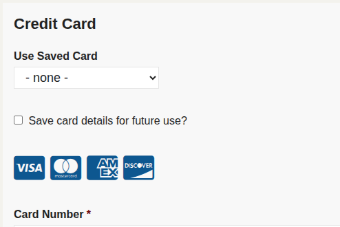

# Payflow Pro

This extension provides an integration with PayPal's Payflow Pro service. It supports one time and recurring payments from CiviCRM.

The extension is licensed under [AGPL-3.0](LICENSE.txt).

## Installation

Learn more about installing CiviCRM extensions in the [CiviCRM Sysadmin Guide](https://docs.civicrm.org/sysadmin/en/latest/customize/extensions/).

## Getting Started

After enabling the extension you will need to go to Administer >> System Settings >> Payment Processors and create a Payment Processor that uses Payflow Pro

## What is supported

This extensions supports:
- One-off payments.
- Refunds.
- Card On File.
- Recurring payments:
  - weekly, monthly, yearly. *Daily could be made to work but the code in this extension does not support currently*.
  - Updating billing details.
  - Updating credit card details.
  - Cancel recurring payment.

## Recurring Contributions

Note: If using test mode you might need to enable the setting "In test mode complete transactions pending settlement." to see contributions in CiviCRM be Completed.

#### PayflowPro.getRecurPaymentHistory

To manually check transactions you can run the API4 PayflowPro.getRecurPaymentHistory job.

#### PayflowPro.importLatestRecurPayments

This is the equivalent of a webhook / IPN for other payment processors but PayflowPro doesn't implement
that so we have to query ourselves on a schedule.

This is automatically configured as a scheduled job (disabled).

You will need to configure the `paymentProcessorID` parameter to match the paymentProcessor that you want to get recurring payments for.

## Card on File

- API docs: https://developer.paypal.com/api/nvp-soap/payflow/integration-guide/card-on-file
- StackExchange discussion: https://stackoverflow.com/questions/70790830/using-paypal-payflow-card-on-file-feature-for-future-recharging-with-their-api

When the PayflowPro card details are shown you will also see (if logged in):
- Use Saved Card (a list of saved cards, if available)
- Save card details for future use?

## Support and Maintenance

This extension is supported and maintained with the help and support of the CiviCRM community by [MJW](https://www.mjwconsult.co.uk).

We offer paid [support and development](https://mjw.pt/support) as well as a [troubleshooting/investigation service](https://mjw.pt/investigation).
